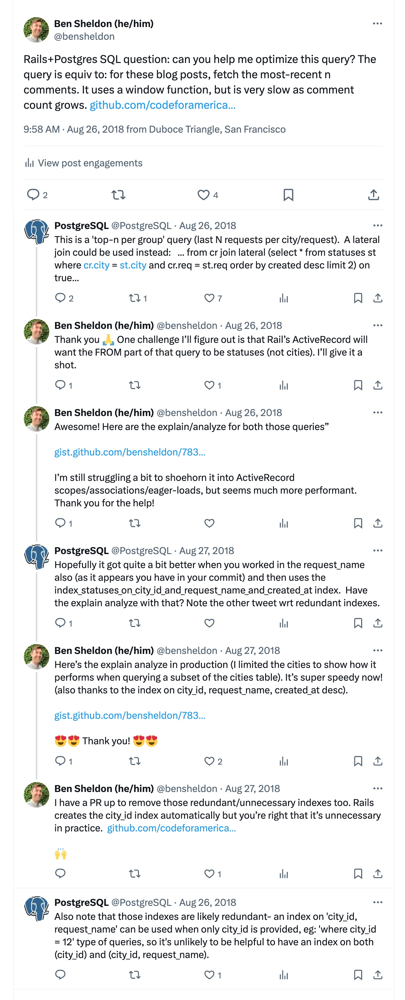

# `activerecord-has_some_of_many`

This gem adds new optimized Active Record association methods (`has_one_of_many`, `has_some_of_many`) for "top N" queries to ActiveRecord using `JOIN LATERAL` that are eager-loadable (`includes(:association)`, `preloads(:association)`) to avoid N+1 queries, and is compatible with typical queries and batch methods (`find_each`, `in_batches`, find_in_batches`). For example, you might have these types of queries in your application:

- Users have many posts, and you want to query the most recent post for each user 
- Posts have many comments, and you want to query the 5 most recent visible comments for each post
- Posts have many comments, and you want to query the one comment with the largest `votes_count` for each post

You can read more about these types of queries on [Benito Serna's "Fetching the top n per group with a lateral join with rails"](https://bhserna.com/fetching-the-top-n-per-group-with-a-lateral-join-with-rails.html).

## Compatibility

This gem is only compatible with databases that offer `LATERAL` joins within Active Record. As far as I'm aware, that is **only Postgres**. 

This gem is not necessary on SQLite, as SQLite will perform lateral-like behavior on join queries by default. MySQL has support for lateral queries, but they are not yet implemented in Active Record.

## Usage

Add to your gemfile, and run `bundle install`:

```ruby
  gem "activerecord-has_some_of_many"
```

Then you can use `has_one_of_many` and `has_some_of_many` in your ActiveRecord models to define these associations.

```ruby
class User < ActiveRecord::Base
  has_one_of_many :last_post, -> { order("created_at DESC") }, class_name: "Post"

  # You can also use `has_some_of_many` to get the top N records. Be sure to add a limit to the scope.
  has_some_of_many :last_five_posts, -> { order("created_at DESC").limit(5) }, class_name: "Post"

  # More complex scopees are possible, for example:
  has_one_of_many :top_comment, -> { where(published: true).order("votes_count DESC") }, class_name: "Comment"
  has_some_of_many :top_ten_comments, -> { where(published: true).order("votes_count DESC").limit(10) }, class_name: "Comment"
end

# And then preload/includes and use them like any other Rails association:
User.where(active: true).includes(:last_post, :last_five_posts, :top_comment).each do |user|
  user.last_post
  user.last_five_posts
  user.top_comment
end

# Aad compound indexes to your database to make these queries fast!
add_index :comments, [:post_id, :created_at]
add_index :comments, [:post_id, :votes_count]
```

## Why?

Finding the "Top N" is a common problem, that can be easily solved with a `JOIN LATERAL` when writing raw SQL queries. Lateral Joins were introduced in Postgres 9.3: 

> a LATERAL join is like a SQL foreach loop, in which Postgres will iterate over each row in a result set and evaluate a subquery using that row as a parameter. ([source](https://www.heap.io/blog/postgresqls-powerful-new-join-type-lateral))
 
For example, to find only the one most recent comments for a collection of posts, we might write:

```sql
SELECT "comments".*
FROM "posts"
INNER JOIN LATERAL (
    SELECT "comments".*
    FROM "comments"
    WHERE "comments"."post_id" = "posts"."id"
    ORDER BY "comments"."created_at" DESC
    LIMIT 1
) lateral_table ON TRUE
WHERE "posts"."id" IN (1, 2, 3, 4, 5)
```

Active Record associations present a bit of a challenge. This is because the association query has `WHERE` conditions added _after_ the association scope that allows changing the foreign key, but not the column name. This means that some indirection is necessary in order to make the query work and have the conditions applied to the correct column in a way that the query planner can efficiently understand and optimize:

```SQL
SELECT "comments".*
FROM (
    SELECT
        "posts"."id" AS post_id_alias,
        "lateral_table".*
    FROM "posts"
    INNER JOIN LATERAL (
        SELECT "comments".*
        FROM "comments"
        WHERE "comments"."post_id" = "posts"."id"
        ORDER BY "comments"."created_at" DESC
        LIMIT 1
    ) lateral_table ON TRUE
) comments
WHERE "comments"."post_id_alias" IN (1, 2, 3, 4, 5)
```

The resulting optimized `EXPLAIN ANALYZE` looks like:

```sql
Nested Loop  (cost=0.56..41.02 rows=5 width=72) (actual time=0.058..0.082 rows=4 loops=1)
  ->  Index Only Scan using posts_pkey on posts  (cost=0.28..17.46 rows=5 width=8) (actual time=0.022..0.027 rows=4 loops=1)
        Index Cond: (id = ANY ('{1,2,3,4,5}'::bigint[]))
        Heap Fetches: 0
  ->  Limit  (cost=0.29..4.70 rows=1 width=64) (actual time=0.012..0.013 rows=1 loops=4)
        ->  Index Scan Backward using index_comments_on_post_id_and_created_at on comments  (cost=0.29..44.46 rows=10 width=64) (actual time=0.012..0.012 rows=1 loops=4)
              Index Cond: (post_id = posts.id)
Planning Time: 0.200 ms
Execution Time: 0.106 ms
```

## History

Back in 2018 I (Ben Sheldon) was working to speed up [Open311 Status](https://status.open311.org), an uptime and performance monitor for government websites; I was using a Window Function at the time to query the most recent status for each monitored website, and it was _slow_ 🐌 I [tweeted about the problem](https://x.com/postgresql/status/1033797250936389633) and the Postgres Twitter account replied and told me about `LATERAL` joins ✨



A few years after that, Benito Serna shared on Reddit an excellent series of blog posts about fetching latest-N-of-each records. The first post didn't mention `LATERAL` joins, so [I commented on that](https://www.reddit.com/r/rails/comments/kmofhp/comment/ghnf0hy/) and he updated the posts to include it 🙌 Since then it's been a go-to reference for these types of queries.

## Development

- Run the tests with `bundle exec rake`
